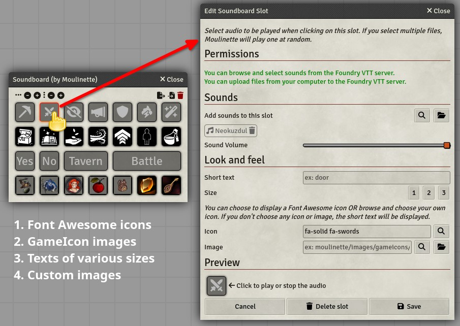
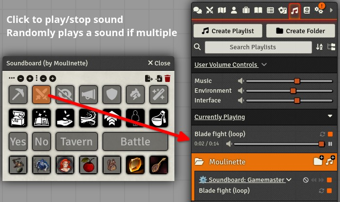
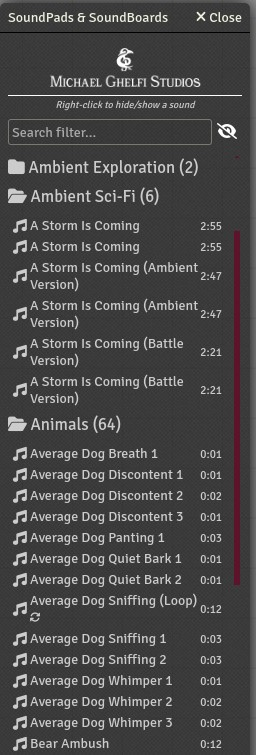
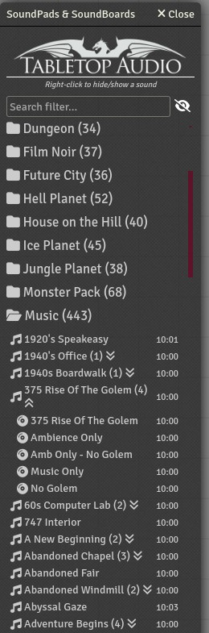
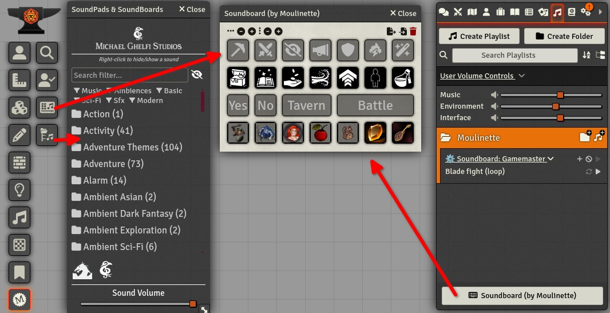

# Moulinette Soundboard & Soundpad (FoundryVTT module)

This module is part of the [Moulinette suite](https://www.moulinette.cloud) of tools designed to simplify the search and use of [TTRPG](https://en.wikipedia.org/wiki/Tabletop_role-playing_game) content for game masters, helping them prepare their game sessions and even manage their games in real time. The module is designed for [FoundryVTT](https://foundryvtt.com/). A soundboard to organize your audio and play it effortlessly. Includes sound and music boards from creators Tabletop Audio and Michael Ghelfi Studios (requires supporting them).

#### Features

* Create soundboards (also functions as a player).
* Assign icons to each slot (integrates with [Moulinette TTRPG Media Search](https://github.com/SvenWerlen/moulinette-foundryvtt-module)).
* Play music or sounds directly from your soundboards.
* Randomly play sounds from slots containing multiple audio tracks.
* Access predefined soundboards from [Michael Ghelfi](https://www.patreon.com/MichaelGhelfi) and soundpads from [Tabletop Audio](https://www.patreon.com/tabletopaudio). (1)

*(1) : Accessing content from premium creators requires supporting both them and Moulinette. The usage rights for the content are specific to each creator.*

  

## <a name=""/>Screenshots

  

## <a name="install"/>Install the module

**Installing** the Module from FoundryVTT

1. Launch Foundry VTT and navigate to the "Add-on Modules" tab in the Setup menu.
2. Search for "Soundboard & Soundpad (by Moulinette)" in the list and click Install.

**Manual Installation** (Not Recommended)

1. Launch Foundry VTT and navigate to the "Add-on Modules" tab in the Setup menu.
2. Click the "Install Module" button and enter the following URL as "Manifest URL":

`https://github.com/SvenWerlen/moulinette-audio-foundryvtt-module/releases/latest/download/module.json`

3. Click Install and wait for the process to complete.

## <a name="support"/>Support me on Patreon

If you like my work and want to support me, consider subscribing to Moulinette!
* [Moulinette on Patreon](https://www.patreon.com/moulinette)
* [Moulinette on Stripe](https://assets.moulinette.cloud/pricing) (requires Patreon authentication)

You can also join [Moulinette Discord](https://discord.gg/xg3dcMQfP2)
